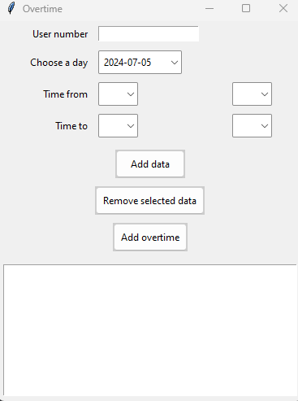

# OVERTIME

## What is a Overtime? 
The application was created for the automatic addition of overtime for employees. 
Overtime is added on an ongoing basis for the HR department, which uses the BeeOffice application. 
In the Overtime application, simply add the employee number, day and overtime hours and the system automatically logs in and adds the required overtime for the employee.  
The aim of the project was to speed up the work of the HR department.  

After entering the user number, the application verifies whether it is in the database, if it does not exist, an error is returned. 
Each entry is validated as to whether it meets the requirements of the input information. 
In this case, whether it is an int of a certain character length. 
Blank fields are automatically filled in to speed up the entry. 

The list created is saved in a .csv file and a script is run when the hours are added. 
The automaton, using selenium, logs into the BeeOffice website, searches for employees and adds the positions according to the indicated data. 
The application returns information about a correct addition or an error.  

## libraries needed

pip install tkcalendar pandas selenium tkTimePicker
